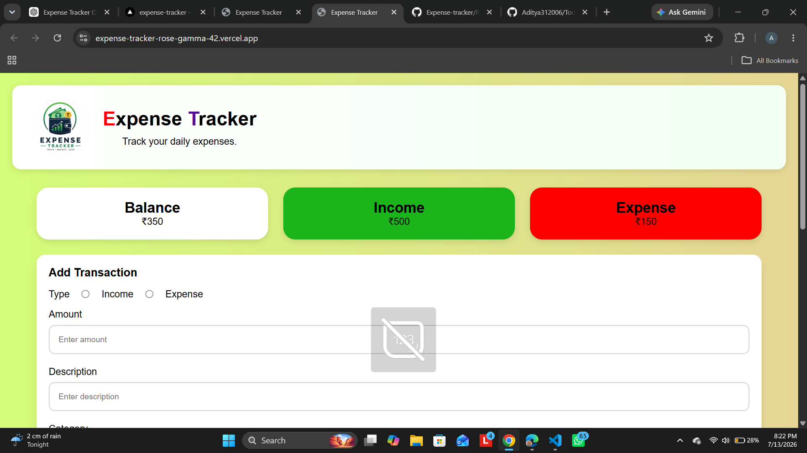

# Expense Tracker

A simple Expense Tracker web application built using HTML, CSS, and JavaScript.

## Features

- Add Income
- Add Expense
- Automatic Balance Calculation
- Delete Transaction
- Local Storage Support
- Data Persistence after Refresh
- Dynamic Form Fields
- Responsive UI

## Technologies Used

- HTML5
- CSS3
- JavaScript (ES6)

## Version

Version 1.0

## Future Updates

- Edit Transaction
- Search Transaction
- Category Filter
- Charts
- Export PDF/Excel
<<<<<<< HEAD
=======

##  Live Demo

https://expense-tracker-rose-gamma-42.vercel.app/

## Source Code 

GitHub repository:https://github.com/Aditya312006/Expense-tracker

## 📸 Screenshot

>>>>>>> cdd4824217634dbc46e5de84fba0ca39018399d4
>>>>>>> 
